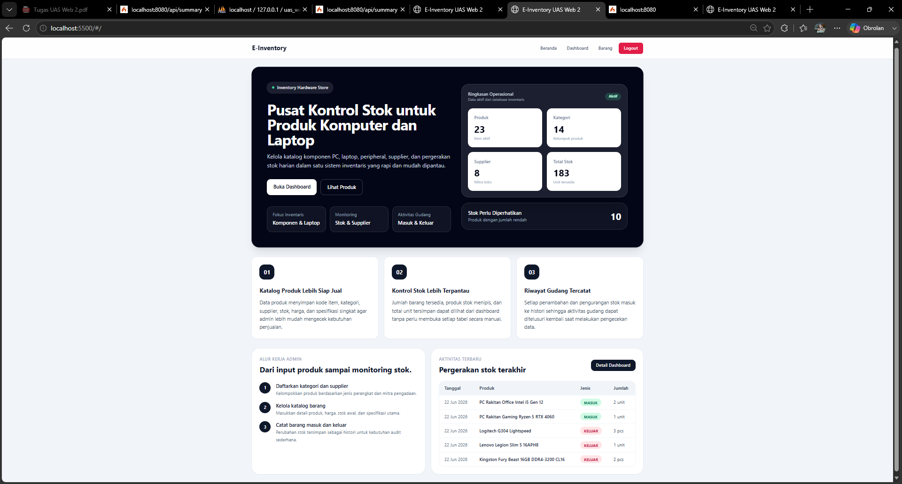
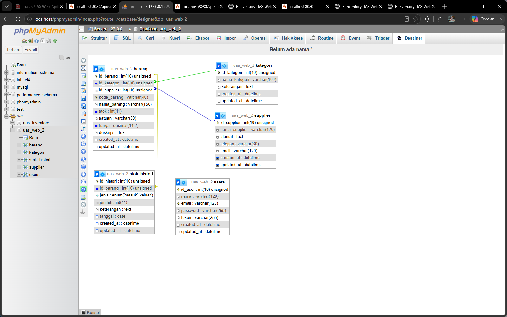
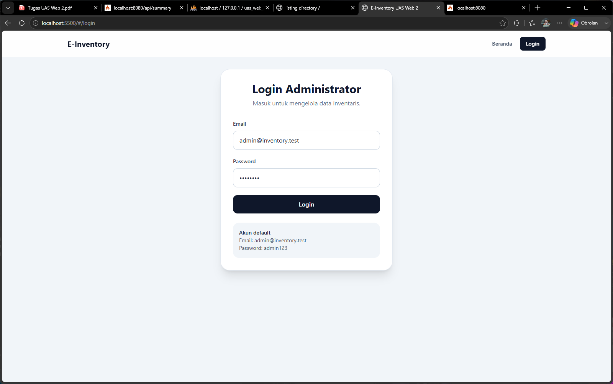
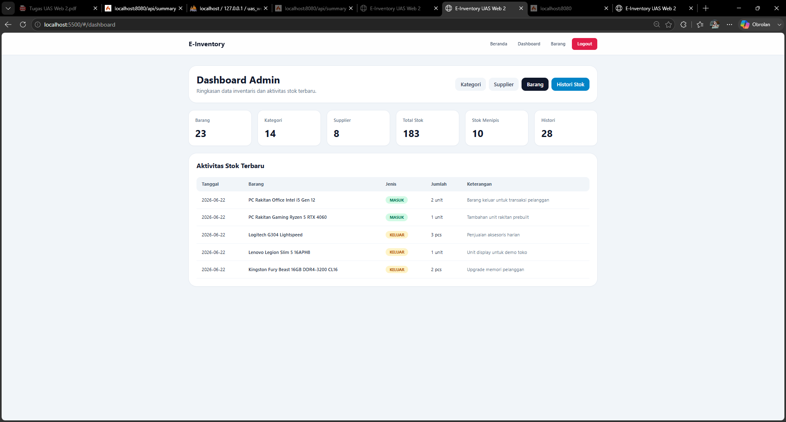
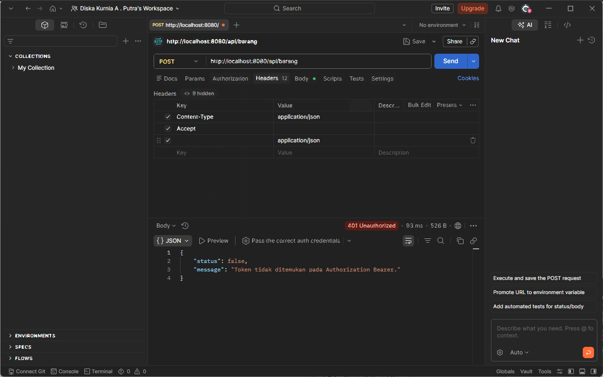
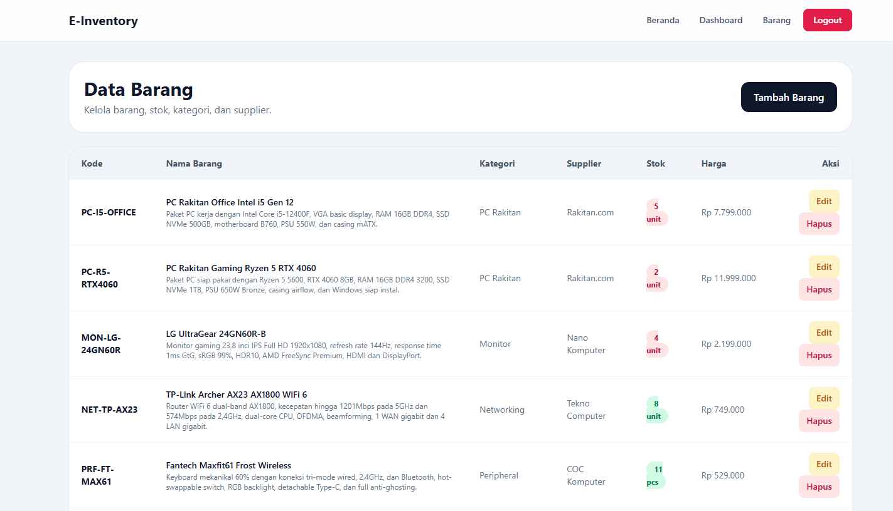
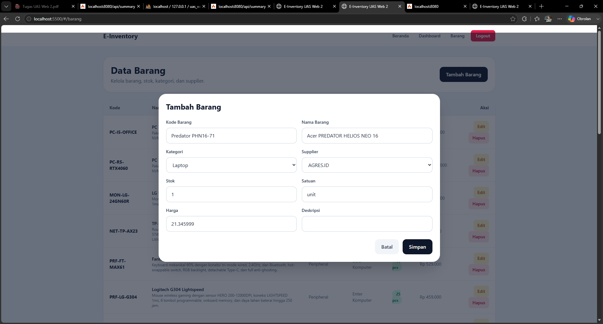
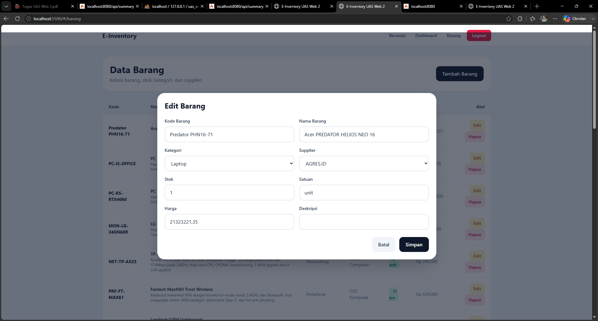

# UAS Pemrograman Web 2 - E-Inventory

## Identitas Mahasiswa


|---|---|
| Nama | Diska Kurnia Azzahra Putra |
| NIM | 312210369 |
| Mata Kuliah | Pemrograman Web 2 |


## Deskripsi Proyek

E-Inventory adalah aplikasi inventaris berbasis web yang dibuat untuk membantu pendataan stok produk komputer dan laptop. Data yang dikelola meliputi kategori produk, supplier, barang, stok tersedia, harga, serta riwayat barang masuk dan keluar. Contoh data pada aplikasi dibuat menyesuaikan inventaris toko komputer, seperti prosesor, kartu grafis, RAM, SSD, power supply, cooling, monitor, router, peripheral, laptop, dan PC rakitan.

Proyek ini menggunakan arsitektur terpisah antara backend dan frontend. Backend berperan sebagai RESTful API server, sedangkan frontend menjadi antarmuka pengguna berbasis Single Page Application. Dengan pemisahan tersebut, proses pengelolaan data menjadi lebih terstruktur karena frontend hanya bertugas menampilkan dan mengirim data, sementara backend menangani validasi, proses database, dan proteksi token.

## Fitur Aplikasi

Fitur utama yang tersedia pada aplikasi ini adalah:

1. Halaman beranda public yang menampilkan ringkasan data inventaris.
2. Login administrator menggunakan email dan password.
3. Dashboard admin untuk melihat total barang, kategori, supplier, total stok, stok menipis, dan histori stok.
4. Manajemen kategori produk.
5. Manajemen supplier.
6. Manajemen data barang.
7. Form tambah dan edit barang menggunakan modal.
8. Pencatatan histori stok masuk dan keluar.
9. Logout administrator.
10. Proteksi endpoint manipulasi data menggunakan Authorization Bearer Token.

## Teknologi yang Digunakan

| Bagian | Teknologi |
|---|---|
| Backend | PHP CodeIgniter 4 |
| API | RESTful API Resource Controller |
| Frontend | VueJS 3 CDN |
| Routing Frontend | Vue Router CDN |
| HTTP Client | Axios CDN |
| UI Framework | TailwindCSS CDN |
| Database | MySQL atau MariaDB |
| Keamanan API | Authorization Bearer Token dan CodeIgniter Filter |

## Struktur Folder

```text
UAS_Web2_312210369_DiskaKurniaAzzahraPutra/
├── backend-api/
├── frontend-spa/
├── database/
├── docs/
└── README.md
```

Keterangan struktur folder:

| Folder | Keterangan |
|---|---|
| backend-api | Berisi project CodeIgniter 4 yang dijalankan sebagai RESTful API server. |
| frontend-spa | Berisi frontend VueJS 3 berbasis CDN, Vue Router, Axios, dan TailwindCSS. |
| database | Berisi file SQL database final yang dapat diimport melalui phpMyAdmin. |
| docs | Berisi dokumentasi pendukung seperti screenshot dan koleksi Postman. |

## Hak Akses Pengguna

| Pengguna | Hak Akses |
|---|---|
| Public | Dapat melihat halaman beranda dan ringkasan data inventaris. |
| Administrator | Dapat login, membuka dashboard, menambah data, mengedit data, menghapus data master, mencatat histori stok, dan logout. |

## Akun Admin Default

| Email | Password |
|---|---|
| admin@inventory.test | admin123 |

## Rancangan Database

Database yang digunakan bernama `uas_web_2`. Database terdiri dari lima tabel utama, yaitu `users`, `kategori`, `supplier`, `barang`, dan `stok_histori`.

| Tabel | Fungsi |
|---|---|
| users | Menyimpan data akun administrator dan token login. |
| kategori | Menyimpan daftar kategori produk. |
| supplier | Menyimpan data supplier atau pemasok barang. |
| barang | Menyimpan data produk, stok, harga, kategori, dan supplier. |
| stok_histori | Menyimpan riwayat barang masuk dan barang keluar. |

Relasi tabel yang digunakan:

```text
kategori 1 --- n barang
supplier 1 --- n barang
barang   1 --- n stok_histori
```

Dengan relasi tersebut, satu kategori dapat memiliki banyak barang, satu supplier dapat memasok banyak barang, dan setiap barang dapat memiliki banyak histori stok.

## Endpoint API

Base URL backend lokal:

```text
http://localhost:8080/api
```

| Method | Endpoint | Akses | Fungsi |
|---|---|---|---|
| POST | /login | Public | Login admin dan menghasilkan token. |
| POST | /logout | Token | Logout admin. |
| GET | /summary | Public | Menampilkan ringkasan data dashboard. |
| GET | /kategori | Public | Menampilkan data kategori. |
| POST | /kategori | Token | Menambah kategori. |
| PUT | /kategori/{id} | Token | Mengubah kategori. |
| DELETE | /kategori/{id} | Token | Menghapus kategori. |
| GET | /supplier | Public | Menampilkan data supplier. |
| POST | /supplier | Token | Menambah supplier. |
| PUT | /supplier/{id} | Token | Mengubah supplier. |
| DELETE | /supplier/{id} | Token | Menghapus supplier. |
| GET | /barang | Public | Menampilkan data barang. |
| POST | /barang | Token | Menambah barang. |
| PUT | /barang/{id} | Token | Mengubah barang. |
| DELETE | /barang/{id} | Token | Menghapus barang. |
| GET | /stok | Public | Menampilkan histori stok. |
| POST | /stok | Token | Menambah histori stok. |
| DELETE | /stok/{id} | Token | Menghapus histori stok. |

Endpoint dengan method POST, PUT, dan DELETE diproteksi menggunakan token. Jika request tidak membawa header `Authorization: Bearer Token`, maka backend akan mengembalikan status `401 Unauthorized`.

## Cara Menyiapkan Database

1. Buka phpMyAdmin.
2. Import file SQL berikut:

```text
database/uas_web_2.sql
```

3. Setelah import berhasil, database `uas_web_2` akan berisi tabel `users`, `kategori`, `supplier`, `barang`, dan `stok_histori`.
4. Data awal sudah berisi contoh inventaris produk komputer dan laptop.

File database yang disertakan pada folder `database` merupakan file SQL final yang digunakan untuk membuat tabel dan data awal aplikasi.

## Cara Menjalankan Backend

Masuk ke folder backend:

```bash
cd backend-api
```

Salin file environment:

```bash
copy .env.example .env
```

Pada Linux atau macOS:

```bash
cp .env.example .env
```

Pastikan konfigurasi database pada file `.env` sesuai dengan MySQL lokal:

```text
database.default.hostname = localhost
database.default.database = uas_web_2
database.default.username = root
database.default.password =
database.default.DBDriver = MySQLi
database.default.port = 3306
```

Jalankan server CodeIgniter:

```bash
php spark serve
```

Backend berjalan pada:

```text
http://localhost:8080
```

## Cara Menjalankan Frontend

Masuk ke folder frontend:

```bash
cd frontend-spa
```

Jalankan dengan Live Server di Visual Studio Code atau server statis lain. Contoh menggunakan Python:

```bash
python -m http.server 5500
```

Frontend berjalan pada:

```text
http://localhost:5500
```

Jika backend tidak berjalan di port 8080, sesuaikan nilai API pada file:

```text
frontend-spa/services/api.js
```

## Pengujian Aplikasi

Pengujian dilakukan secara lokal dengan menjalankan backend pada `localhost:8080` dan frontend pada `localhost:5500`. Hasil pengujian menunjukkan bahwa frontend dapat mengambil data dari API, administrator dapat login, route admin terlindungi, dan endpoint manipulasi data menolak request tanpa token.

Pengujian utama yang dilakukan:

| Pengujian | Hasil |
|---|---|
| Beranda mengambil ringkasan data dari API | Berhasil |
| Login administrator | Berhasil |
| Dashboard admin | Berhasil |
| CRUD kategori | Berhasil |
| CRUD supplier | Berhasil |
| CRUD barang | Berhasil |
| Histori stok masuk dan keluar | Berhasil |
| Route guard halaman admin | Berhasil |
| POST /api/barang tanpa token di Postman | Gagal dengan 401 Unauthorized |

## Dokumentasi Screenshot

Screenshot berikut digunakan sebagai bukti hasil akhir aplikasi setelah backend, frontend, database, autentikasi, proteksi API, dan fitur pengelolaan data berhasil diuji secara lokal. Semua gambar disimpan pada folder `docs/screenshots/` agar dokumentasi GitHub lebih rapi.

### 1. Halaman Beranda

Halaman beranda menampilkan ringkasan operasional inventaris, jumlah produk, kategori, supplier, total stok, stok yang perlu diperhatikan, alur kerja admin, dan aktivitas stok terbaru. Tampilan ini dibuat sebagai halaman public sehingga dapat dilihat tanpa login.



### 2. Relasi Database

Screenshot ini menunjukkan relasi tabel pada phpMyAdmin Designer. Tabel `barang` memiliki relasi ke tabel `kategori` dan `supplier`, sedangkan tabel `stok_histori` berelasi dengan tabel `barang`. Relasi ini digunakan agar data inventaris tidak berdiri sendiri dan tetap terhubung antar tabel.



### 3. Halaman Login Administrator

Halaman login digunakan oleh administrator untuk masuk ke sistem. Setelah login berhasil, token dari backend disimpan pada localStorage dan digunakan oleh Axios untuk mengakses endpoint yang membutuhkan autentikasi.



### 4. Dashboard Admin

Dashboard admin menampilkan ringkasan utama inventaris setelah administrator berhasil login. Informasi yang ditampilkan meliputi total produk, kategori, supplier, total stok, stok menipis, dan riwayat aktivitas stok terbaru. Halaman ini menjadi pusat pemantauan sebelum admin mengelola data kategori, supplier, barang, dan histori stok.



### 5. Pengujian API 401 Unauthorized di Postman

Screenshot Postman menunjukkan pengujian endpoint `POST /api/barang` tanpa mengirimkan Authorization Bearer Token. Hasilnya backend mengembalikan status `401 Unauthorized`. Pengujian ini membuktikan bahwa endpoint manipulasi data sudah diproteksi dan tidak dapat digunakan sembarang request.



### 6. Tabel Data Barang

Halaman data barang menampilkan daftar produk inventaris dalam bentuk tabel. Pada tabel ini terlihat kode barang, nama barang, deskripsi singkat, kategori, supplier, stok, harga, serta tombol aksi edit dan hapus. Data produk dibuat menyesuaikan inventaris toko komputer agar contoh datanya lebih realistis.



### 7. Form Tambah Barang

Form tambah barang menggunakan modal agar admin dapat mengisi data tanpa berpindah halaman. Pada screenshot form tambah, data Acer Predator Helios Neo 16 digunakan sebagai contoh input manual untuk memastikan proses penyimpanan data barang berjalan dari frontend ke backend API.

Pada bagian harga, pengujian dilakukan dengan input manual untuk memastikan data dapat masuk dari form frontend ke database melalui API. Jika format angka yang dimasukkan belum sesuai dengan nilai yang diharapkan, data dapat dibuka kembali melalui form edit untuk disesuaikan. Pada hasil akhir tabel, harga ditampilkan dalam format Rupiah agar lebih mudah dibaca. Field deskripsi dapat diisi dengan spesifikasi produk, tetapi pada contoh pengujian tertentu dibiarkan kosong untuk menunjukkan bahwa data utama tetap dapat diproses selama field wajib seperti kode barang, nama barang, kategori, supplier, stok, satuan, dan harga sudah terisi.



### 8. Form Edit Barang

Form edit barang digunakan untuk mengubah data yang sudah tersimpan. Pada screenshot ini terlihat bahwa data yang sudah masuk dapat dipanggil kembali ke dalam modal, kemudian diperbarui melalui endpoint API yang dilindungi token.



## URL Demo Aplikasi

```text
Diisi setelah aplikasi berhasil dihosting secara publik.
```

## Link Video Presentasi

```text
Diisi setelah video presentasi diunggah ke YouTube.
```

## Catatan Deployment

Aplikasi dapat dijalankan secara lokal dengan dua server, yaitu backend CodeIgniter 4 dan frontend VueJS SPA. Untuk demo publik, backend perlu ditempatkan pada hosting yang mendukung PHP dan MySQL. Frontend dapat ditempatkan pada hosting yang sama atau layanan static hosting, selama alamat API pada frontend diarahkan ke backend yang aktif dan konfigurasi CORS pada backend tetap berjalan.
